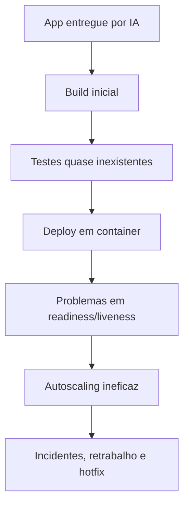
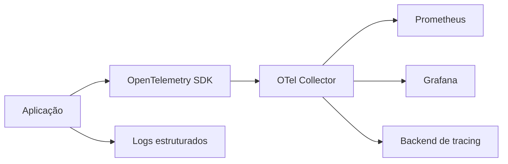
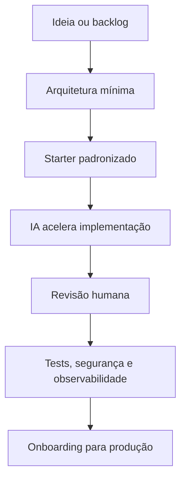

**Resumo:** quando uma aplicação é produzida quase inteiramente por IA, mas sem base sólida de engenharia de software, o onboarding para produção deixa de ser um exercício de automação e passa a ser um trabalho de contenção de risco. O problema não é a IA. O problema é usar IA para amplificar decisões ruins, ausência de arquitetura e desconhecimento operacional.

<!--more-->

## Introdução

Nos últimos anos, o desenvolvimento assistido por IA saiu do campo da curiosidade e entrou de vez no ciclo normal de entrega de software. Em muitos times, já é comum ver geração de código, criação de testes, sugestão de refatorações, montagem de infraestrutura e até escrita inicial de documentação com apoio de ferramentas de IA.

Isso, por si só, não é um problema. Na prática, IA é um acelerador de produtividade. Ela reduz atrito, encurta o caminho entre intenção e implementação e ajuda times experientes a ganhar escala. O ponto crítico aparece quando a velocidade da geração passa a ser confundida com maturidade de engenharia.

É nesse cenário que a equipe em que atuo, junto com outras equipes de DevSecOps, Platform Engineering e SRE, começa a receber aplicações que “funcionam” no ambiente local, mas chegam completamente frágeis para produção. Na prática, isso aumenta o volume de trabalho porque o que deveria ser uma entrada simples para o pipeline vira uma análise cuidadosa de arquitetura, operação, segurança e observabilidade. Em vez de um sistema projetado com critérios claros, chega um conjunto de arquivos que parece software, mas se comporta como protótipo permanente.

Minha posição é direta: o problema não é a IA. O problema é usar IA sem compreender os fundamentos que continuam sustentando software sério em ambiente corporativo.

## Contextualização: o crescimento do desenvolvimento assistido por IA

Ferramentas de IA mudaram o ritmo de desenvolvimento. Elas ajudam a escrever boilerplate, gerar endpoints, criar consultas, montar pipelines e até propor arquitetura inicial. Em times maduros, isso vira ganho real. Em times sem base técnica, isso vira dívida operacional acelerada.

O risco não está apenas em “código ruim”. O risco está em código que foi produzido rápido demais, com pouca revisão conceitual, sem trade-offs explícitos e sem a disciplina que normalmente existiria em uma equipe de engenharia experiente.

Quando uma equipe sem domínio de arquitetura, system design e engenharia de software usa IA como substituto de pensamento crítico, o resultado costuma ser previsível:

- decisões inconsistentes de arquitetura;
- ausência de fronteiras entre domínios;
- dependências acopladas e difíceis de versionar;
- pouca ou nenhuma atenção a observabilidade;
- segurança tratada como etapa final;
- deploy pensado depois do código pronto.

Em termos práticos, a IA não cria esses problemas do nada. Ela torna mais barato produzir o erro. E quando o erro é barato, ele se propaga rápido.

> **Ponto-chave:** a IA amplia capacidade. Ela também amplia defeitos de processo, falta de conhecimento e atalhos arquiteturais.

## O que normalmente chega para uma equipe DevSecOps

Na rotina, o onboarding de uma aplicação gerada quase toda por IA raramente começa com uma arquitetura limpa e um plano de operação. O que chega costuma ser uma coleção de sinais de que o software foi construído a partir da pergunta “como faz funcionar?” e não da pergunta “como isso vai sobreviver em produção?”.

| O que chega | O que isso significa para DevSecOps |
|---|---|
| Repositório sem padrão de estrutura | Alto custo para entender fluxo, dependências e pontos de falha |
| Testes inexistentes ou superficiais | Sem base para CI confiável, rollback seguro ou mudança controlada |
| Dockerfile improvisado | Imagens grandes, lentas e difíceis de auditar |
| Configuração espalhada no código | Segredos, parâmetros e ambientes ficam frágeis e inseguros |
| Manifests Kubernetes genéricos | Falta de health checks, recursos e estratégia de rollout |
| Logs em texto solto | Observabilidade limitada e difícil correlação em incidentes |
| Dependências desatualizadas | Aumento direto de risco de supply chain e SCA |

Em muitos casos, o primeiro trabalho da equipe não é “fazer o deploy”. É descobrir se o sistema pode ser tornado operável sem reescrita completa.

## Principais problemas encontrados

### Arquitetura

O primeiro problema costuma ser arquitetural. Aplicações quase totalmente geradas por IA frequentemente seguem o caminho de menor resistência: uma base monolítica gigante, com todas as regras misturadas, sem fronteira de domínio e sem intenção clara de evolução.

#### Monólitos gigantes e acoplamento excessivo

Monólito não é sinônimo de problema. O problema é um monólito sem modularização real, em que auth, negócio, persistência, integrações, validação e apresentação se misturam no mesmo fluxo. Nessa situação, qualquer mudança pequena afeta partes aparentemente desconectadas.

O acoplamento excessivo aparece quando o código depende de detalhes internos de outras camadas, de formatos específicos de payload e de efeitos colaterais espalhados. O resultado é um sistema difícil de testar, difícil de evoluir e ainda mais difícil de isolar em incidentes.

#### Ausência de separação de responsabilidades

Quando uma IA gera código sem direcionamento arquitetural, é comum ver serviços que fazem tudo: recebem requisição, validam regra, consultam banco, chamam APIs externas, montam resposta, registram auditoria e ainda lidam com tentativa de retry. Isso mata a separação de responsabilidades e cria funções enormes, opacas e frágeis.

#### Violação de SOLID e falta de patterns

Em ambientes assim, princípios como Single Responsibility, Open/Closed e Dependency Inversion praticamente desaparecem. A IA pode produzir algo “bonito” na superfície, mas isso não significa que exista um desenho sustentável.

Também é comum a ausência de padrões simples e úteis: Factory, Strategy, Adapter, Repository, Circuit Breaker, Outbox, Queue Consumer, Bulkhead. Não se trata de aplicar pattern por fetiche. Trata-se de criar linguagem estrutural para lidar com crescimento e mudança.

#### Código duplicado e dependências circulares

Duplicação surge quando a aplicação foi criada com pressa e sem visão de domínio. Pequenas variações de regra são copiadas para outras áreas. Isso gera manutenção cara e inconsistência funcional.

Dependências circulares são outro sinal clássico. Em código gerado, elas aparecem com frequência porque o sistema foi montado por proximidade funcional, não por arquitetura. Isso bagunça build, dificulta refatoração e torna o grafo de dependências incontrolável.

### System Design

Se a arquitetura mostra a forma do problema, o system design mostra seu impacto operacional.

#### Não existe estratégia de escalabilidade

Aplicações geradas sem pensamento de sistema costumam assumir carga fixa, latência constante e crescimento linear. Isso não existe em produção real. Picos acontecem. Dependências externas falham. Filas acumulam. O fluxo precisa ser tolerante ao imprevisível.

#### Estado em memória e sessões locais

Guardar estado em memória é um atalho comum. Funciona até o primeiro restart, reschedule ou scaling horizontal. Quando a sessão vive localmente, qualquer tentativa de replicação vira problema.

#### Cache inexistente e banco como gargalo

Sem cache, toda leitura pesa diretamente no banco. Quando o banco vira ponto único de verdade e de gargalo, a aplicação deixa de escalar com elegância. A equipe de DevSecOps passa a olhar para métricas de conexão, pool, saturação e tempo de resposta sem encontrar camadas intermediárias que aliviem a pressão.

#### Ausência de filas e APIs síncronas para tudo

Muita aplicação IA-first tenta resolver tudo com chamadas síncronas em cadeia. Isso acopla latência, aumenta chance de timeout e cria cascatas de falha. Em vez de desacoplar processamento, o sistema empurra cada operação para o caminho mais frágil.

#### Falta de idempotência, tolerância a falhas e alta disponibilidade

Quando não existe idempotência, retry vira risco. Quando não existe tolerância a falhas, uma dependência externa derruba o fluxo inteiro. Quando não existe estratégia de alta disponibilidade, qualquer indisponibilidade vira incidente operacional e, às vezes, indisponibilidade de negócio.

> **Observação:** sistema bom não é o que nunca falha. É o que falha de forma previsível, detectável e recuperável.

### Cloud e Kubernetes

É aqui que o onboarding começa a doer para valer. Muitas aplicações geradas por IA foram desenhadas para “rodar”, não para serem operadas em orquestradores modernos.

#### Por que são difíceis de colocar em Kubernetes

Kubernetes pressupõe contratos operacionais mínimos. A aplicação precisa sinalizar quando está viva, quando está pronta, como encerra, como escala e como lida com estado.

Se isso não existe no código, a plataforma vira uma camada de compensação, não de habilitação.

#### Health checks, readiness e liveness

Sem `readinessProbe`, o tráfego pode chegar antes da aplicação estar pronta. Sem `livenessProbe`, processos travados continuam presos no pod. Sem uma resposta coerente desses checks, o cluster não toma decisões corretas.

#### Graceful shutdown

Muitas aplicações não fecham conexões, não drenam requests e não preservam integridade ao receber `SIGTERM`. Em rollout, isso vira request perdido, fila corrompida ou transação interrompida.

#### Horizontal scaling, requests e limits

Escalar horizontalmente não é apenas aumentar réplicas. A aplicação precisa ser stateless o suficiente para suportar isso. Se o estado está em memória, o autoscaling quebra a experiência do usuário.

Sem `requests` e `limits`, o scheduler trabalha no escuro. Sem ajuste de CPU e memória, HPA e VPA ficam imprecisos. Sem observação do comportamento sob carga, a plataforma escala no lugar errado.

#### Persistent storage, ConfigMaps, Secrets e service discovery

Se a aplicação mistura configuração com código, o deploy vira intervenção manual. Se usa storage persistente sem necessidade, complica resiliência e expansão. Se não conversa bem com service discovery, o ambiente deixa de ser dinâmico e passa a depender de suposições frágeis.



### DevSecOps

Do ponto de vista de DevSecOps, o problema mais caro não é apenas encontrar vulnerabilidades. É não ter base suficiente para automatizar controle de qualidade de forma confiável.

#### Quando não existe padrão

Sem padrão de branch, estrutura, dependências e build, cada aplicação exige uma pipeline quase artesanal. Isso aumenta o lead time e reduz a chance de manutenção sustentável.

#### Quando não há testes nem cobertura

Sem testes, a pipeline perde força como mecanismo de confiança. Sem cobertura mínima, qualquer ajuste vira aposta. Em equipes maduras, CI não serve só para “passar”. Serve para provar que a mudança não quebrou o comportamento esperado.

#### Build lento, imagens grandes e Dockerfiles ruins

Build lento reduz frequência de feedback. Imagem grande aumenta custo de download, expansão e patching. Dockerfile ruim costuma ser sintoma de uma aplicação que foi empacotada sem foco em previsibilidade.

**Dockerfile ruim**

```dockerfile
FROM node:18
WORKDIR /app
COPY . .
RUN npm install
EXPOSE 3000
CMD ["npm", "start"]
```

**Dockerfile otimizado**

```dockerfile
FROM node:20-alpine AS deps
WORKDIR /app
COPY package*.json ./
RUN npm ci --omit=dev

FROM node:20-alpine AS runner
WORKDIR /app
ENV NODE_ENV=production
COPY --from=deps /app/node_modules ./node_modules
COPY . .
USER node
EXPOSE 3000
CMD ["node", "server.js"]
```

#### Segredos versionados e credenciais hardcoded

Este é um dos sinais mais perigosos. Quando segredos aparecem em código, a equipe de DevSecOps herda um problema que já se espalhou: rotação, revogação, auditoria e risco de exposição.

#### SAST, SCA, Secret Scanning, Container Scanning, IaC Scanning, SBOM e Supply Chain Security

Ferramentas de segurança não resolvem arquitetura ruim, mas ajudam a impedir que problemas óbvios passem despercebidos.

- **SAST** encontra padrões inseguros no código.
- **SCA** identifica dependências vulneráveis e desatualizadas.
- **Secret Scanning** detecta chaves, tokens e credenciais expostas.
- **Container Scanning** avalia vulnerabilidades no sistema base e em pacotes da imagem.
- **IaC Scanning** encontra problemas em Terraform, Helm, Kubernetes manifests e afins.
- **SBOM** documenta a composição real do software.
- **Supply Chain Security** fecha a conversa em torno de proveniência, integridade e confiança.

**Exemplo de pipeline GitLab CI**

```yaml
stages:
  - test
  - sast
  - sca
  - build
  - container_scan
  - deploy

unit_tests:
  stage: test
  image: node:20
  script:
    - npm ci
    - npm test -- --coverage

semgrep_sast:
  stage: sast
  image: returntocorp/semgrep
  script:
    - semgrep scan --config p/owasp-top-ten --json --output semgrep.json

owasp_dependency_check:
  stage: sca
  image: owasp/dependency-check:latest
  script:
    - dependency-check.sh --scan . --format JSON --out dependency-check

trivy_container:
  stage: container_scan
  image: aquasec/trivy:latest
  script:
    - trivy fs --severity HIGH,CRITICAL --exit-code 1 .
    - trivy image --severity HIGH,CRITICAL --exit-code 1 registry.example/app:latest
```

**Exemplo de GitHub Actions**

```yaml
name: security-pipeline

on:
  push:
    branches: ["main"]

jobs:
  scan:
    runs-on: ubuntu-latest
    steps:
      - uses: actions/checkout@v4
      - uses: actions/setup-node@v4
        with:
          node-version: 20
      - run: npm ci
      - run: npm test -- --coverage
      - uses: aquasecurity/trivy-action@master
        with:
          scan-type: fs
          severity: HIGH,CRITICAL
          exit-code: 1
```

**Exemplo de SonarQube**

```properties
sonar.projectKey=app-gerada-por-ia
sonar.sources=src
sonar.tests=test
sonar.javascript.lcov.reportPaths=coverage/lcov.info
sonar.qualitygate.wait=true
```

**Exemplo de Semgrep e Trivy em comandos diretos**

```bash
semgrep scan --config p/security-audit --config p/owasp-top-ten src/
trivy fs --scanners vuln,secret,misconfig .
```

### Observabilidade

Observabilidade não entra depois. Ela deveria nascer junto com a aplicação. Em apps geradas sem maturidade, normalmente há três cenários: logs espalhados, métricas inexistentes ou tracing só no slide da apresentação.

#### Logging estruturado

Log em texto livre até ajuda no começo, mas degrada rápido em incidentes. Sem estrutura, não há correlação confiável por `trace_id`, `request_id`, usuário ou serviço.

#### Métricas e dashboards

Sem métricas, ninguém enxerga latência, erro, throughput, saturação e consumo de recursos. Prometheus e Grafana não são acessórios; são parte do contrato operacional.

#### Tracing distribuído e OpenTelemetry

Em sistemas distribuídos, tracing é a única forma prática de enxergar a jornada da requisição entre serviços. OpenTelemetry virou o caminho mais pragmático para instrumentação consistente.

**Exemplo de configuração de ambiente para OpenTelemetry**

```yaml
env:
  - name: OTEL_SERVICE_NAME
    value: app-gerada-por-ia
  - name: OTEL_EXPORTER_OTLP_ENDPOINT
    value: http://otel-collector:4317
  - name: OTEL_RESOURCE_ATTRIBUTES
    value: service.namespace=platform,deployment.environment=prod
```

**Exemplo de arquitetura de observabilidade**



### Segurança

A camada de segurança sofre diretamente quando a aplicação foi construída sem revisão séria de fundamentos.

#### JWT implementado incorretamente

É comum ver JWT validado de forma parcial: assinatura ignorada, expiração tratada mal, audience inexistente e refresh token sem proteção adequada.

#### Autorização inexistente

Autenticação sem autorização é uma falha clássica. A aplicação reconhece o usuário, mas não valida o que ele pode ou não fazer.

#### Falhas recorrentes de aplicação

- SQL Injection por concatenação de string;
- XSS por escaping insuficiente;
- SSRF por consumo irrestrito de URL externa;
- upload inseguro sem validação de tipo e tamanho;
- CORS permissivo demais;
- rate limiting inexistente;
- secrets no repositório;
- dependências desatualizadas com CVEs conhecidas.

Essas falhas não são “detalhes”. São resultado direto de um projeto que foi produzido sem modelo mental de segurança e sem revisão experiente.

**Exemplo de Kubernetes Deployment com requisitos mínimos de operação**

```yaml
apiVersion: apps/v1
kind: Deployment
metadata:
  name: app-gerada-por-ia
spec:
  replicas: 3
  selector:
    matchLabels:
      app: app-gerada-por-ia
  template:
    metadata:
      labels:
        app: app-gerada-por-ia
    spec:
      containers:
        - name: app
          image: registry.example/app:1.0.0
          ports:
            - containerPort: 3000
          resources:
            requests:
              cpu: "100m"
              memory: "128Mi"
            limits:
              cpu: "500m"
              memory: "256Mi"
          readinessProbe:
            httpGet:
              path: /ready
              port: 3000
            initialDelaySeconds: 5
          livenessProbe:
            httpGet:
              path: /health
              port: 3000
            initialDelaySeconds: 15
          lifecycle:
            preStop:
              exec:
                command: ["sh", "-c", "sleep 10"]
```

**Exemplo de Terraform para base de operação**

```hcl
terraform {
  required_version = ">= 1.6.0"
}

resource "kubernetes_namespace" "app" {
  metadata {
    name = "app-gerada-por-ia"
    labels = {
      owner = "platform"
      tier  = "prod"
    }
  }
}
```

## Impactos na operação

Quando uma aplicação chega nesse estado, o impacto não é apenas técnico. É organizacional.

### Operação mais lenta e mais cara

Cada incidente passa a exigir leitura de código, ajuste de infraestrutura, correção de build e, muitas vezes, intervenção manual. O time de plataforma deixa de operar um sistema e passa a sustentar um protótipo em produção.

### Mudanças viram risco

Sem testes, sem contratos e sem observabilidade, toda alteração parece arriscada. Isso desacelera times de produto e aumenta dependência de janelas de manutenção e hotfixes.

### Incidentes ficam mais difíceis de diagnosticar

Sem logs estruturados, sem tracing e sem métricas úteis, o tempo médio para identificar causa raiz cresce. O time investiga sintomas em vez de causas.

### Pipeline deixa de ser guardrail e vira obstáculo

Quando a base é ruim, a pipeline sofre. Ela precisa compensar ausência de padrões, blindar segredos, detectar vulnerabilidades, validar build e ainda impedir regressões funcionais. O resultado é um pipeline complexo, caro e, muitas vezes, contestado por quem produziu o código.

## Como isso aumenta a dívida técnica

Dívida técnica não é só código feio. É uma obrigação acumulada que cresce quando a organização escolhe velocidade sem controle.

Com IA mal usada, a dívida aumenta em quatro dimensões:

1. **Dívida de arquitetura**: o sistema nasce sem fronteiras e fica mais caro de modularizar depois.
2. **Dívida operacional**: faltam sinais, contratos e previsibilidade para operar em produção.
3. **Dívida de segurança**: vulnerabilidades entram cedo e ficam muito mais caras para corrigir depois de espalhadas.
4. **Dívida de plataforma**: a equipe de DevSecOps precisa criar exceções, adaptar pipelines e construir remendos sob pressão.

O grande problema é que IA acelera a criação dessa dívida. E dívida criada rápido parece produtividade no curto prazo.

## Como poderia ser evitado

Evitar esse cenário não significa bloquear IA. Significa colocar engenharia antes da automação.

### 1. Definir um baseline arquitetural

Antes de gerar código, o time precisa definir as fronteiras do sistema, o modelo de estado, os contratos de integração e o padrão de persistência.

### 2. Criar templates e starters oficiais

Times maduros não deixam cada projeto inventar sua própria forma de nascer. Eles disponibilizam skeletons, pipelines padrão, observabilidade padrão, policy-as-code e exemplos aprovados.

### 3. Exigir testes e qualidade mínima

Cobertura não é tudo, mas ausência de testes é sinal de risco. CI precisa bloquear código sem validação básica.

### 4. Integrar segurança desde o início

SAST, SCA, secret scanning, container scanning, IaC scanning e SBOM devem fazer parte do fluxo padrão, não de uma etapa posterior.

### 5. Projetar a aplicação para operar

Se ela não tem health checks, não é stateless, não respeita shutdown e não foi pensada para escalar, ela ainda não está pronta para produção.

### 6. Tratar IA como copiloto, não como arquiteto

IA pode sugerir, acelerar e padronizar. Mas a responsabilidade por design, trade-offs e operação continua humana. Isso inclui revisão técnica séria, threat modeling e decisão consciente sobre o que entra ou não no sistema.



## Conclusão

Equipes DevSecOps não estão ali para dizer “não”. Elas existem para tornar software colocável em produção de forma segura, observável, escalável e sustentável.

Quando uma aplicação quase toda gerada por IA chega sem fundamentos de engenharia de software, o time não encontra apenas bugs. Encontra ausência de pensamento de sistema, ausência de disciplina arquitetural e ausência de preocupação com operação.

Por isso, a discussão correta não é sobre culpar IA. A discussão correta é sobre responsabilidade técnica. IA é excelente para acelerar trabalho, mas também acelera erros quando o humano que guia o processo não domina os fundamentos.

> **Uma aplicação que funciona não é necessariamente uma aplicação pronta para produção.**

## Considerações finais

Se há uma lição prática aqui, ela é simples: a diferença entre protótipo e software de produção continua sendo engenharia.

Arquitetura continua sendo responsabilidade humana. System design continua sendo responsabilidade humana. Segurança continua sendo responsabilidade humana. E a missão de DevSecOps não é apenas construir pipelines; é transformar aplicações em ativos operáveis, auditáveis e resilientes.

Quando essa base existe, a IA vira multiplicador de capacidade. Quando ela não existe, a IA apenas deixa o problema mais rápido, mais barato de criar e mais caro de corrigir. Na rotina da equipe em que atuo, isso significa mais triagem, mais retrabalho e mais esforço para transformar uma entrega frágil em algo realmente operável.

## Fontes e referências

As referências abaixo foram usadas como base conceitual para este artigo, especialmente para boas práticas de arquitetura, Kubernetes, observabilidade e segurança da cadeia de software:

- [Kubernetes Documentation](https://kubernetes.io/docs/)
- [Kubernetes: Configure Liveness, Readiness and Startup Probes](https://kubernetes.io/docs/tasks/configure-pod-container/configure-liveness-readiness-startup-probes/)
- [Kubernetes: Define a Command and Arguments for a Container](https://kubernetes.io/docs/tasks/inject-data-application/define-command-argument-container/)
- [OpenTelemetry Documentation](https://opentelemetry.io/docs/)
- [Prometheus Documentation](https://prometheus.io/docs/introduction/overview/)
- [Grafana Documentation](https://grafana.com/docs/)
- [OWASP Top 10](https://owasp.org/www-project-top-ten/)
- [OWASP Cheat Sheet Series](https://cheatsheetseries.owasp.org/)
- [OWASP Dependency-Check](https://owasp.org/www-project-dependency-check/)
- [Semgrep Documentation](https://semgrep.dev/docs/)
- [Trivy Documentation](https://aquasecurity.github.io/trivy/)
- [GitLab CI/CD Documentation](https://docs.gitlab.com/ee/ci/)
- [GitHub Actions Documentation](https://docs.github.com/actions)
- [Dockerfile reference](https://docs.docker.com/reference/dockerfile/)
- [SonarQube Documentation](https://docs.sonarsource.com/sonarqube/)
- [Terraform Documentation](https://developer.hashicorp.com/terraform/docs)

